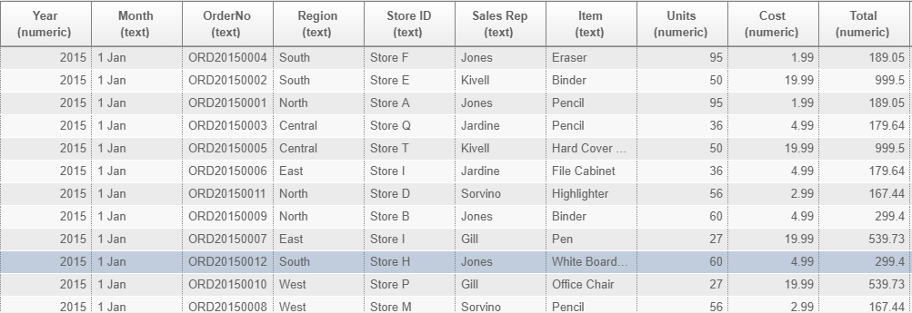
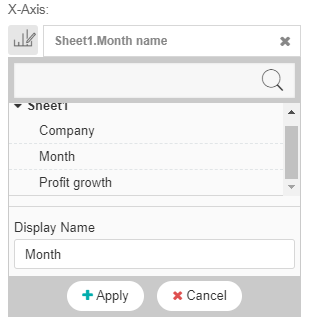

# GIANT 101: Using line charts

## Introduction:

Line charts effectively show the trends of data. Line charts are easy for the audience to understand and can also be used to show the KPIs of a company. It is most effective when using date-time data. For example, showing **sales across years** using line charts is important in order to understand how the company is progressing.

## Example 1

In this example, we want to show the **total sales across years** using the **Stationary Sales** data source.

This is the data structure of the sample data we are using. We have to use the built-in aggregate functions given the data structure if we want to show the **total sales across years**. 

After we connect to our data source: **Stationery Sales**, we choose the x-axis to be **year** to represent the time and the y-axis as the **sum** of **units**. We have to use the **sum** built-in function because of the way the data is structured, so that we can visualize what we want.

This is the given output:

Since we are only showing the **total number of sales across years**, there is no need for a legend. 

Click the hamburger icon in the top right of the screen and the **legend** option will pop up. Click on the legend option and select **no legend**. 

## Example 2

Now, we will be using data on the DHL Malaysia. We are showcasing **DHL trends in profit growth over time across years**. The idea of comparing any KPI over months in specific years gives a good gauge of a company is performance. A linechart shows this information very effectively.

Given the structure of the data, we will not have to use any of GIANT's built-in aggregate functions because the data is organised in this manner. However, this may not be the case for all data. Always take the time to understand how to utilize GIANT's built-in functions if the data is not structured the way you want it to be.

First, we connect to the source: **dhl-profit-growth.xlsx**. This can be found in [sample-data](sample-data/giant-101). The x-axis will be **Month name** to represent the months over time and our y-axis will be **profit growth**.

Always remember to change the **Display Name** of the columns when choosing the axis. We want to make sure that the naming of the axis is appropriate for the target audience to read. Ideally, we do not want any "_" or "-" within the display name. The axis should be labeled to reflect clearly the data that we want to show.

This is our given output:

This line chart succesfully shows the data. However, what is wrong with it? Notice that the months are not in order. Because the **Month_name** column is of data-type: *text*, GIANT orders the months alphabetically. There are two methods of solving this.

Within the data there is an extra column called **Month** which are integers assigned to each month e.g. **January = 1**, **February = 2** etc. So we go to the **Sort(s)** section and we sort the data in **Ascending** order by my column **Month**.

This gives the following output:

Now the months are sorted! 

The second method would be to **rename the values within the columns**. If you have a column similar to **Month_name**, instead of naming the months like **January**, **February** etc. , name it **01 Jan**, **02 Feb**. This way, given the column is of data type *string* or *text*, GIANT will recognise and order the months accordingly.

## GIANT's built in functions

**Unique** - Counts the distinct values within the column chosen. For example, if the data contains multiple names, it only takes into account a unique name once. This is particularly useful when wanting to know how many unique users exist in the consumer base.

**Count** - Counts the number of rows within a column.

**Maximum** - Takes the maximum value within a column.

**Minimum** - Takes the minimum value within a column.

**Sum** - Sums the numeric values within a column.

**Average** - Takes the average value within a column.

**None** - Does not affect a column. Used when current data is already aggregated.

**Group by** - Used when wanting to look at the data within different groups of the data. For example: **Sales within categories for different age groups**.

**Sort** - Sorts the data in ascending/descending order depending on the data/data-type.

**Filter** - Allows choosing columns within the table to filter specific criteria for the data.

## Important Points

- If the data showcased has more than 2 dimensions, choose a different chart to represent the data.

- When performing more specific analysis by making comparisons, limit the data points. For example: When showing **top products sold across time**, limit it to the **top 10** products so the chart does not get messy. 

Go to the **All/Top/Bottom** feature under **Settings**. Click the **All** button and click **Top**.

Set the number to limit the data. In this example, choose the **top 10** points of the data. This filters the data based on the axis of the data.

- In certain situations, if there is certain **continuous data**, use a bar chart instead.
 
 Here is the link to bar-chart documentation:
    [using-bar-chart.md](using-bar-chart.md)
