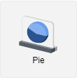
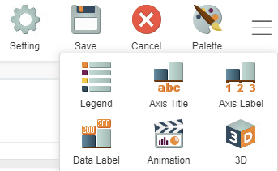

# GIANT 101: Using Pie Charts

## Introduction
Pie charts effectively show the proportions of data. When you want to understand what item makes the most of sales or what age group makes up the most of the consumer base, pie-charts are very effective as they are very simple to read.

## Example 1 

In this example, we will be using a source called **Stationary Sales**. 

This is the structure of the data that we will be using. If we want to show the **total sales of each region** (to show the proportion of sales by the regions), we can use the built-in aggregate functions of GIANT. In this case, this is important because we want to show which region has performed better.

First, we connect to the **Stationery Sales** source. The category axis refers to the categories that we want to visualize. In this case, it is **region**. Given the structure of the data, we need to sum the number of **units** in order to get the **total number of sales** in each region for the value-axis. If we were to use any other built-in function, the numbers would not be accurate and we would be getting the wrong information. 

This is the given output:

This succesfully shows the proportion of total sales within each region. However, we can make improvements to this chart.

Click the hamburger icon in the top right of the screen and the **legend** option will pop up. Click the legend option and select **no legend**. 

We remove the legend because there are already labels which exist to help show the data details to the audience. This makes the information easier to read for the targeted audience as it is less messy.

## Example 2

If we are only interested in looking at the sales within any specific regions within a specific period, we would need to use the **filter** tool.

If the company we were showcasing to is only interested in **total sales in 2016 for the West, North and South region**, we would filter the data in order to showcase only the specific data that we want. Here you can see we filter by **North, South and West** and by data only within the year **2016**. This is the given output:

From here we can see that South region provided the most sales in 2016. So if we were in 2016, we would think of sending more inventory to the South region because they contribute to 49.29% of our sales.

## GIANT's Built-In Functions

**Unique** - Counts the distinct values within a column. For example, if the data contains multiple names, it only takes into account a unique name once. This is particularly useful when wanting to know how many unique users exist in the consumer base.

**Count** - Counts the number of rows within a column.

**Maximum** - Takes the maximum value within a column.

**Minimum** - Takes the minimum value within a column.

**Sum** - Sums the numeric values within a column.

**Average** - Takes the average value within a column.

**None** - Does not affect your column. Used when current data is already aggregated.

**Group by** - Used to group data. For example: **Sales by Region for different Age Groups**.

**Sort** - Sorts data in ascending/descending order depending on the data type.

**Filter** - Allows filtering specific criteria to show certain data.

## Important Notes

- It is important to know that the pie chart is a simple chart that cannot handle data that requires 3 dimensions. 

- The aim is to make it as easy as possible for the audience to understand the data. If there is categorical data that can be easily shown using a pie chart, do not use a bar chart.

- If the data has more than 5 categories, use a bar chart instead to showcase the given information.

    Here is the link to  bar chart documentation:
    [using-bar-chart.md](using-bar-chart.md)
