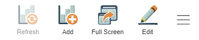
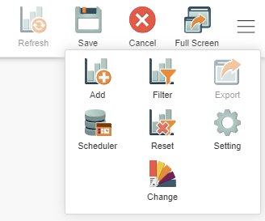
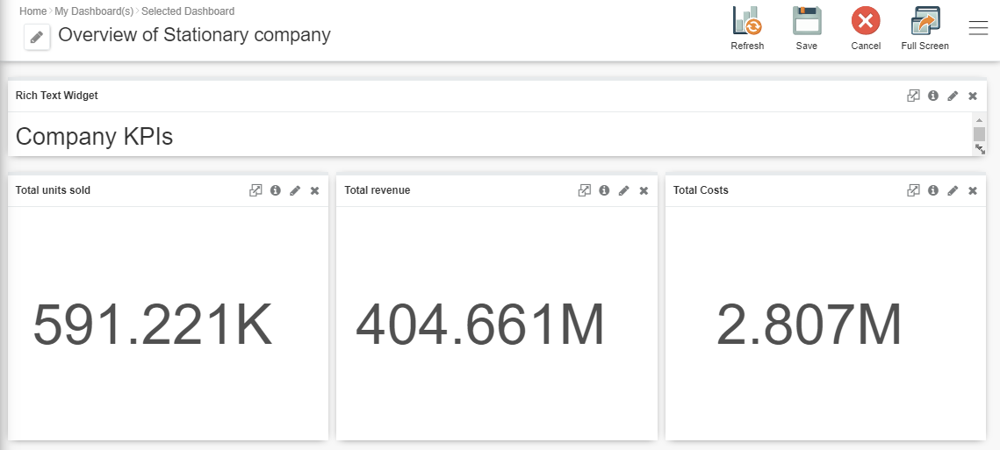
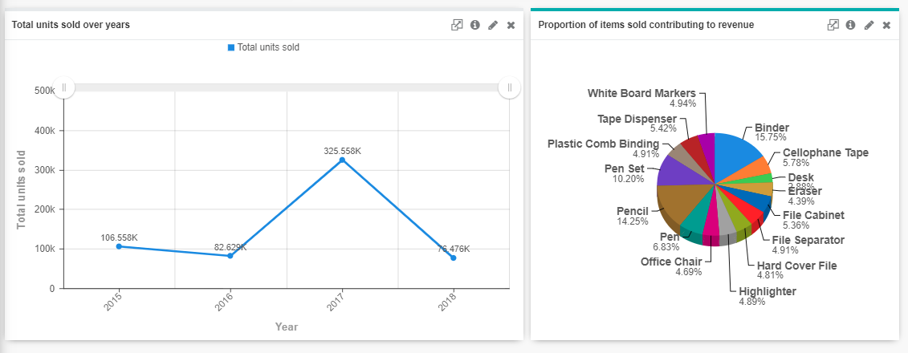
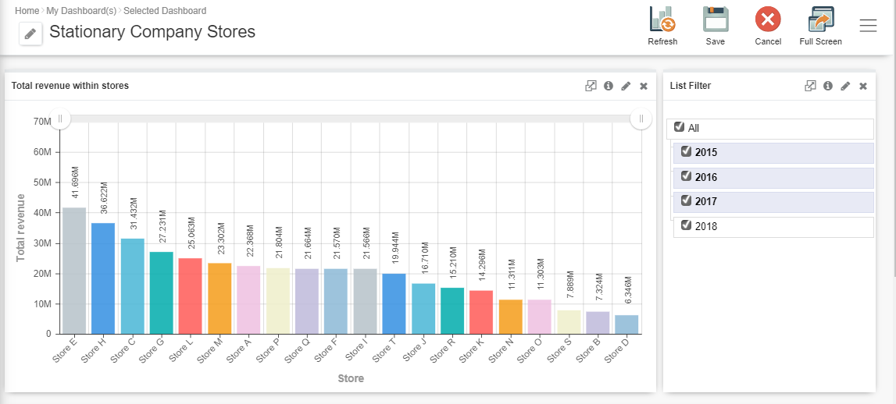
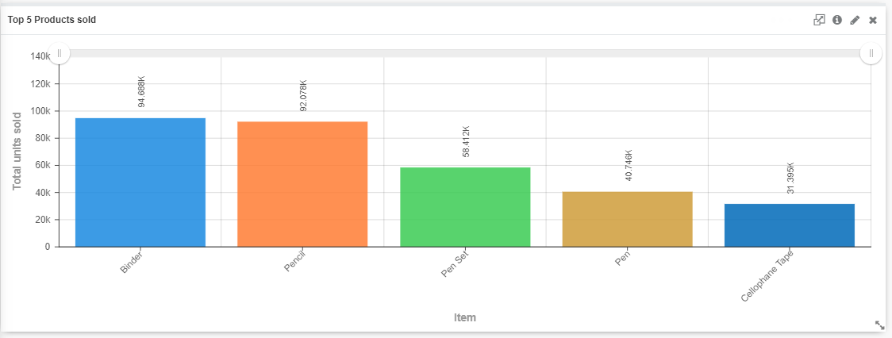

# GIANT 101: Visual layouting

## Introduction

This guide gives tips on how to layout dashboards to make it both aesthetically pleasing and organised. This is very important as GIANT's dashboard feature is a powerful presenting tool. Instead of using the conventional static powerpoint, GIANT's dashboard feature allows for more interesting and interactive presentations.

## Dashboard themes:

First we want to decide on what theme is best to present the charts. GIANT provides many samples to choose from.

Click the **edit** icon.

Then click the **hamburger icon** and it will come up with these options. Click **Change** and there will be different themes available. The white theme is the best option because it is clean and easy to match with other colours. However, it depends on the charts curated.

## Example 1:

For this example, we are going to use the source: **Stationery Sales**. We are going to focus on the overview/summary of this sample company. When we are looking at a summary, we include KPI's and use graphs that best show the overviews of data such as line graphs, bar graphs etc.

First we create a dashboard with the title of what we are showcasing. We show all the important KPIs. We layout the dashboard as if we were presenting with it. So first, we talk about the total units sold followed by how much revenue was made and the total cost beared. Then we show visual examples that showcase summaries of the company's performance.

Here we show the **total units sold** over **years** by a line graph and the **proportion of items sold contributing to renvenue** by a pie chart. All these charts were created in order to showcase the **summary** of the Stationary company. These representations of data coincides with the story we are trying to tell: How is the company performing? However, If we wanted to perform more specific analysis on the same company it would be a good idea to create a seperate dashboard. In context, the overview dashboard will showcase different information than the other dashboard so it will be easier for the target audience to understand.

## Example 2:

In this example we are going to use the connection source: **Stationery Sales** once more but we are going to perform more specific analysis. Instead of looking at the summary of the companies performance, say we wanted to analyze how each store was doing instead.

We create a new dashboard to showcase performance within each store for the Stationary Company. We include a **list filter** that allows the data to be filtered by year so we can get a good idea of how the performance of each store varied over the years. 

We also create a barchart to showcase the top 5 products sold and use **cross-chart** so when users click on different stores from the first bar chart, it will show the top 5 products sold within that store. 

If you are new to the cross chart function, refer to [analysing-using-top-10-and-crossfilter](../giant/analysing-using-top-10-and-crossfilter.md)

This allows us to tell our story specific to our analysis. We look at the revenue generated within each store to see which store is performing the best followed by filtering it out by the latest year of data we have. Then we see what products are popular within the stores that are doing the best using the **cross-chart** function. The Stationary company may want to know this to prioritize which item to stock in each store.

As we are talking about a more specific part of the analysis, It is easier to use a seperate dashboard so the audience understands that we are telling a different part of the story.

## Important Points:

- The layout of the dashboard heavily depends on the story being told. We seperate general analysis from specific analysis into different dashboards so we do not overpopulate a single dashboard and overwhelm the target audience with information.

- This allows clear and concise dashboards as we use GIANT to present two different topics under the same analysis.

