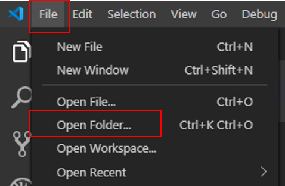
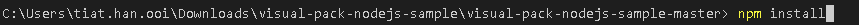
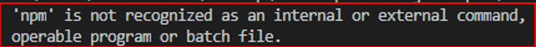
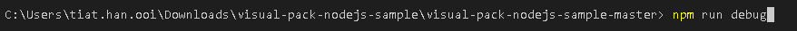
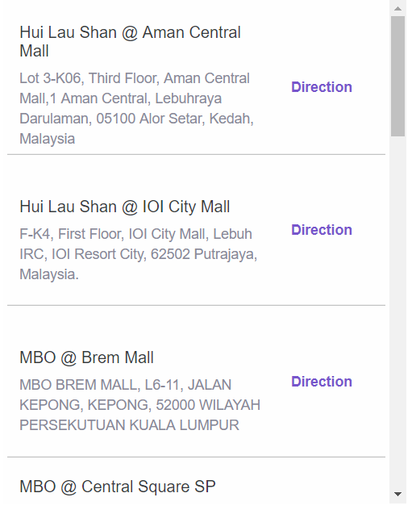
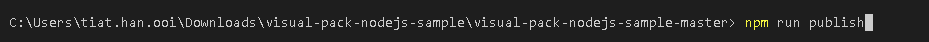
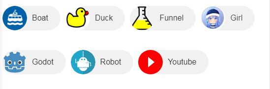
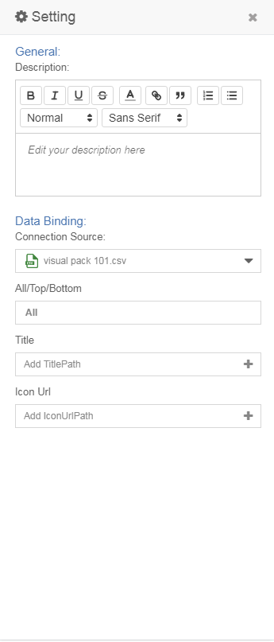
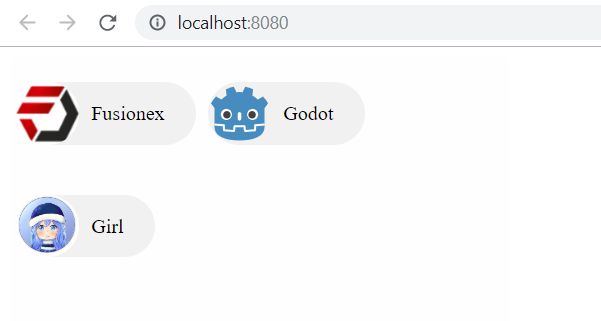
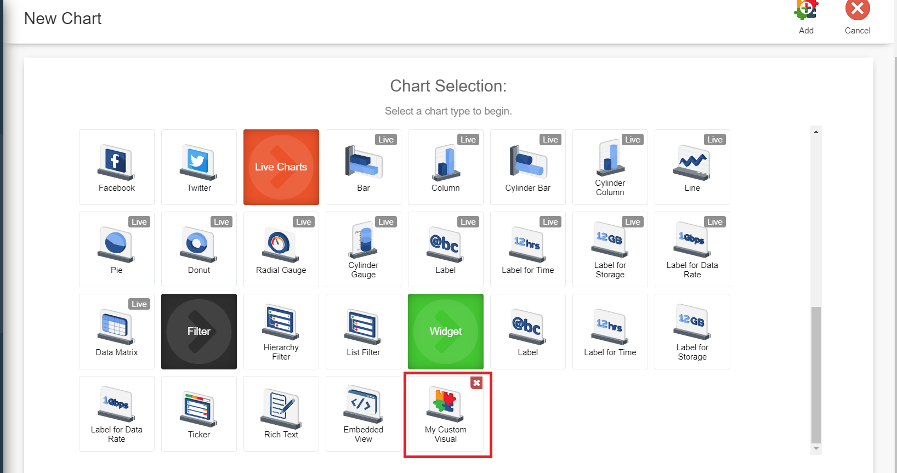

# Visual Pack 101

## Introduction
A visual pack allows the developer to teach GIANT how to render custom and unique visuals that are data driven.

## Setting Up
1. Download the sample visual pack from github [here](https://github.com/fx-giant/visual-pack-nodejs-sample).
> Note : you also may perform `git clone` to get the sample visual pack.

2. Unzip the sample visual pack. Then launch Visual Studio Code and open the folder you just downloaded.
    
    
    
3. Open a New Terminal in Visual Studio Code by clicking *Terminal* => *New Terminal* found in the tab in the top left hand corner of your screen.

4. In the terminal, type and run `npm install`.

    

    > If you see the error below please install nodejs and retry.


5. After `npm install` is completed, run `npm run debug` and open **localhost:8080** in a new browser to see the sample visuals.

    

    
    > Debugging can be done here.

6. Follow the guide in [here](https://github.com/fx-giant/visual-pack-nodejs-sample) to upload the visual pack to GIANT. Run `npm run publish` to upload. 

    
    > **Make sure to follow the steps in the [documentation](https://github.com/fx-giant/visual-pack-nodejs-sample) before running `npm run publish`.**
7. Go to GIANT, **My Dashboard(s)** => **Add** => **VIEW DASHBOARD** => **Add**. You should see the visual pack you uploaded in the list of charts.

## Creating Contact Chips



1. Go to `src/app.js` and replace the code with the below code. This is to generate the html of the chart, we will use d3 to render the chart. Refer [here](https://d3js.org/) for more information about d3. All the render logic will be done here.

    ```js
    //More code above
    const d3Root = d3.select(content)
        .append("div")
        .attr("class", "my-custom-visual")
        .style("height", "100%")
        .style("width", "100%");

        const d3Chip = d3Root.selectAll("div")
        .data(data)
        .enter()
        .append("div")
        .attr("class", "chip");

        d3Chip.append("span")
            .text(d => d[titlePath])
            .append("img")
            .attr("class", "chip_image")
            .attr("src", d => d[iconUrlPath]);
    ```


2. Go to `src/app.scss` and replace all the code with the below code. You can add your own css if you wish to add more styling to the visual pack. Styling of the chart will be done here.


    ```css
    .chip {
        box-sizing: border-box;
        display: inline-block;
        margin: 20px 5px;
        padding: 0 25px;
        height: 50px;
        font-size: 16px;
        line-height: 50px;
        border-radius: 25px;
        background-color: #f1f1f1;
    }

    .chip_image {
        float: left;
        margin: 0 10px 0 -25px;
        height: 50px;
        width: 50px;
        border-radius: 50%;
    }
    ```

3. Go to `pubish/visual/quadrant-properties.html` and replace the code with the below code. This is to change the setting panel in GIANT.

    ```html
    <!-- More code above-->
    <quadrant-control params="controlType: 'single-dimension-quadrant-control',
                                  labelKey: 'Title',
                                  parameterKey: 'titlePath', 
                                  controlType: 'simpleSingleBinding', 
                                  bindingType: 'dimension', 
                                  quadrantViewModel: quadrantViewModel">
    </quadrant-control>
    <quadrant-control params="controlType: 'single-dimension-quadrant-control',
                                  labelKey: 'Icon Url',
                                  parameterKey: 'iconUrlPath', 
                                  controlType: 'simpleSingleBinding', 
                                  bindingType: 'dimension', 
                                  quadrantViewModel: quadrantViewModel">
    </quadrant-control>
 
    ```
    
    
    
4. Go to `pubish/visual/quadrant-properties.js` and replace the code with the below code. This is to set the name of binded data and use it in `src/app.js`.

    ```js
    //More code above
    const properties = [
      {propertyName: "titlePath"},
      {propertyName: "iconUrlPath"}
    ];
    //More code below
    ```
4. Replace program.js code with the below code
```js
window["myCustomVisual"].default.render({

  htmlJContent() {

    return {
      html() { },
      0: document.getElementById("app")
    }

  },
  visual() {
    return {
      parameters: {
        titlePath: "RedeemLocation.LocationName",
        iconUrlPath: "RedeemLocation.GoogleMapUrl"
      }
    }
  },
  data() {
    return [
      {
        "RedeemLocation.LocationName": "Fusionex",
        "RedeemLocation.GoogleMapUrl": "https://media.licdn.com/dms/image/C4E0BAQFIlv0NZ_C4fQ/company-logo_200_200/0?e=2159024400&v=beta&t=6py2jqEFkTx53HDcRFf0oNyj0t4W8WZKyM53ixT2hFo",
      },
      {
        "RedeemLocation.LocationName": "Godot",
        "RedeemLocation.GoogleMapUrl": "https://upload.wikimedia.org/wikipedia/commons/6/6a/Godot_icon.svg"
      },
      {
        "RedeemLocation.LocationName": "Girl",
        "RedeemLocation.GoogleMapUrl": "	https://encrypted-tbn0.gstatic.com/images?q=tbn:ANd9GcQgmwMTrzbP3jQlxtg0OYnTRNrpnkHFsxUzAW8RzJXLd8Jy4g8vgg"
      }
    ]
  }
}, function () {
});
```
6. Run `npm run debug` to debug on localhost. Open browserr and browse to **localhost:8080** to see result.

    
7. Run `npm run publish` to upload the visual pack to GIANT.
8. Using [this](https://github.com/fx-giant/data-hackaton-201907/blob/master/03-Giant%20Visual%20Pack/data%20sources/visual-pack-101.csv) as a connection source, render the contact chips. 

    

### Additional Information
- `src/app.js`: Render logic, how to use the data and create the chart.
- `src/app.scss`: Styling of chart, how to make the chart aesthetically pleasing.
- `src/program.js`: Mock data used for debugging, data that you  see in localhost.
- `publish/visual/quadrant-properties.html`: Properties/Setting panel, what data I need to provide to render the chart.
- `publish/visual/quadrant-properties.js`: Underlying process, what are the data and its name I need from the properties panel.