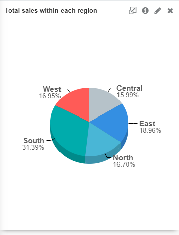
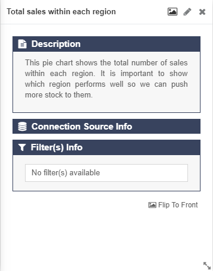
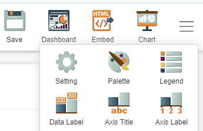
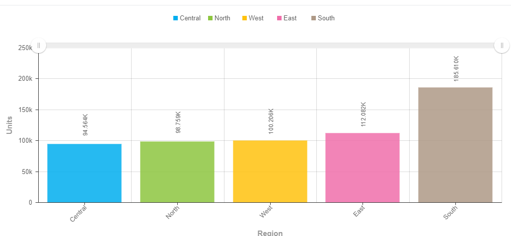

# Visual styling: Descriptions and Colour

## Introduction:

This guide will quickly brief you on how to use descriptions and colour when creating your charts.

## Example descriptions:

Using descriptions give context to both the creator and target audience on what the chart is showcasing. Descriptions should be short and sweet but should also effectively summarize what the chart is trying to achieve. It is also helpful to use a description as it may serve as a reminder when presenting if there are a lot of charts to showcase. The description may also help you explain things about your charts that the title cannot.

This shows the **Total sales within each region** as the title explains.

However, the description helps to show the purpose of the chart and why it was created in the first place. This allows there to be additional key information that is useful when presenting to the target audience.

## Example colour:

Choosing colours heavily depend on what chart is being used. GIANT already has some built-in colour schemes that it provides when choosing the colours of a chart.

Click the **hamburger icon** at the top right of the screen and click the **Palette** option. Then, choose what kind of colour scheme to use.

Always choose a colour scheme that is bright and has many options so it is easier for the audience to read. This is important as it may be essential for your audience to distinguish the differences in your data represented by your chart.

**Important note**: Choosing colours is dependant on what chart you are using and what information you want to convey to your audience.
