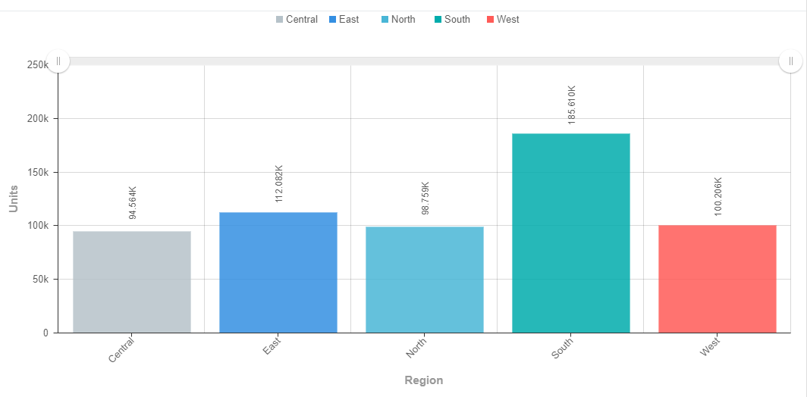
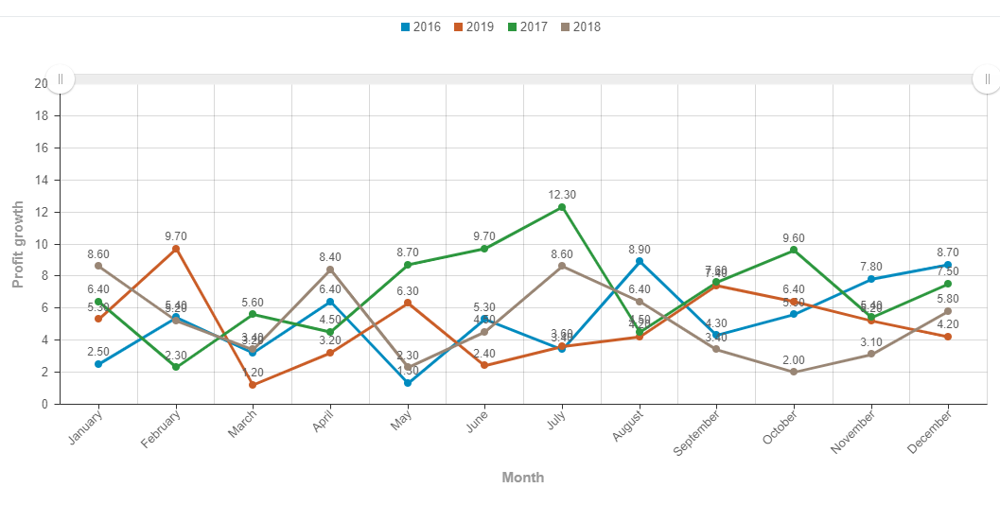
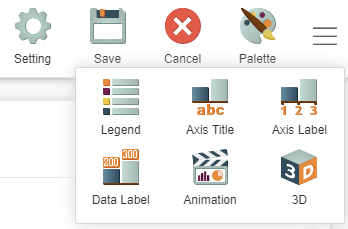
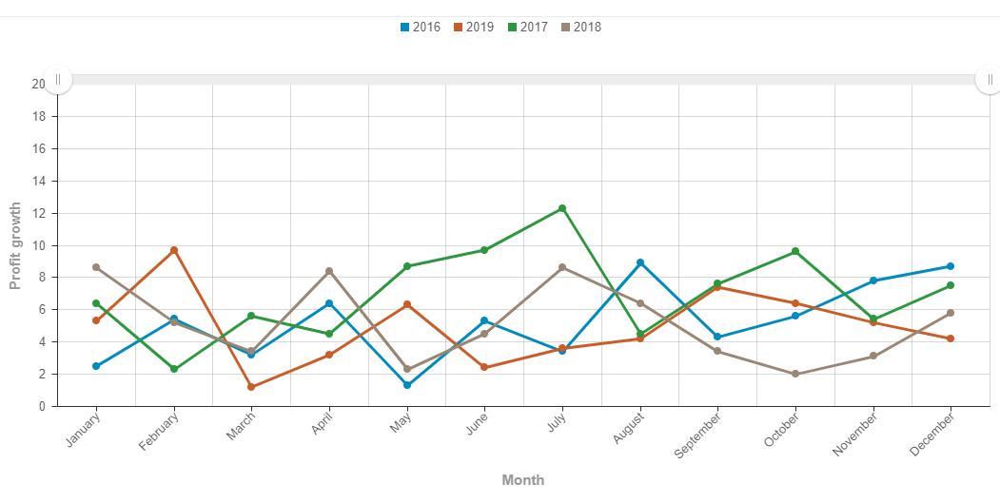
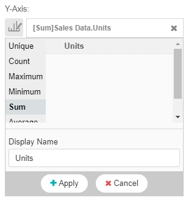
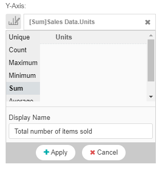

# Visual styling : Labels

## Introduction:

This guide will show you how to appropriately utilize both data labels and axis labels.

## Example of Data labels:

Usage of data labels heavily depends on the story you are trying to tell with your chart. 

In this case my bar chart shows the **total sales within each region**. I want to use this chart to compare regions peformance so it is key that I keep the data label when I am presenting. This allows me to show the signficance of the numbers paired with visuals making it easier for the target audience to understand. 

If I had a line chart which showcased the **profit growth over months grouped by years** and I just wanted my target audience to focus on the trends, the data label is not so relevant.

I click the hamburger icon in the top right of the screen and click on the **Data Label** feature. Then I click on the **no label** option to remove the data labels.

Removing the data labels have made it easier for my audience to read and understand my chart better as it is less messy and does not lose what I want to show from my data.

## Example of axis labels:

Axis labels are very important because it allows the target audience to understand your charts. Always include axis labels to make it easier for the viewer to read. In some cases, your column might not exactly reflect what you want to show to your reader, especially when you are using Giant's aggregate functions. 

In this case, I want to **sum units** from my column but **Sum Units** or **Units** would not be a appropriate name for what I want to call my axis. 

Thus I rename my **Display Name** to what I want to show from my chart. In this example, **Sum Units** refers to the total items sold which will make it easier for my target audience to read.

**Important note**: Using these features depends on your charts and use case so always think about what you want to show before considering these features.