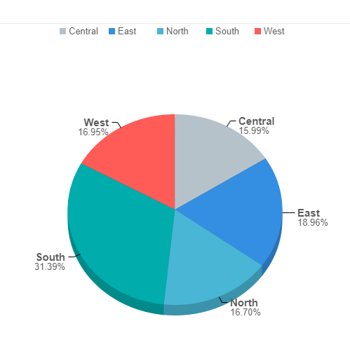
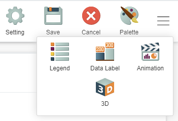
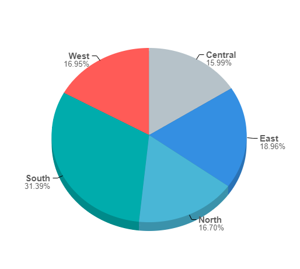
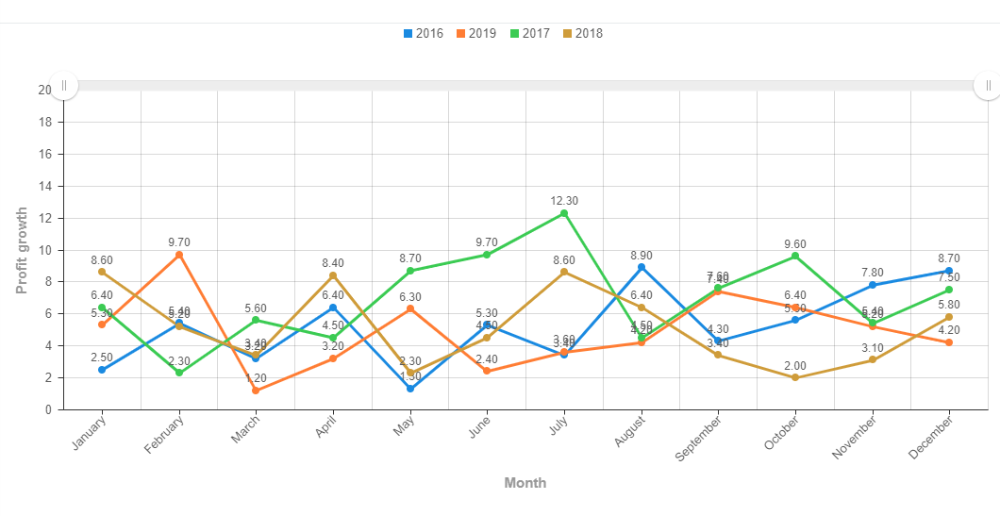
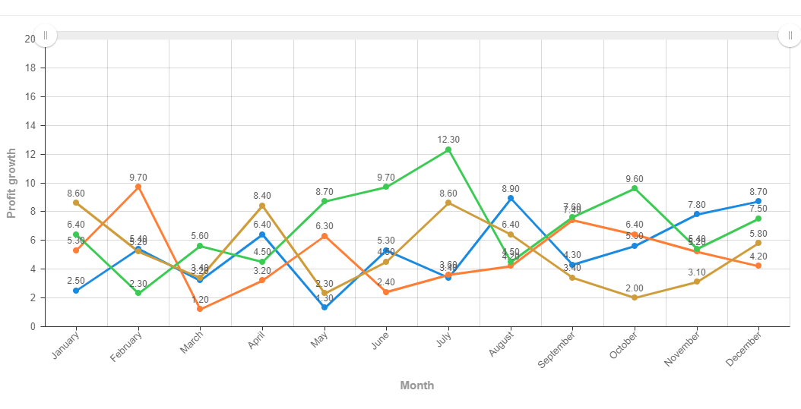

# Visual styling : Legend 

## Introduction:

This guide will show how to properly use legends when creating charts in GIANT.

## Example 1:

This pie chart shows the **percentage of the total number of sales within each region**. As we can see, the legend shows the different regions within each category. However, since this chart already labels the data, we do not need the legend.

Click the **hamburger icon** at the top right of the screen. Click **legend**, followed by the **no legend** option. This is the given output:

Even though we do not have a legend anymore, we do not lose any information we want to convey to our target audience. The **percentage of total sales within each region** is still clearly shown to the viewer.

**Important Note**: Legends are normally used when it can provide information the current chart itself cannot convey to the user.

## Example 2:

In this example, this line chart shows the **profit growth of a single company across months grouped by years**. In this case, using a legend is important here because users are able to distinguish which line represents which year.

If the line chart did not have any legend, the target audience could not tell which line represents the profit growth in which year. Without a legend, we lose important information that is key in telling the story from this chart.

## Summary:

Always think of how the legend affects the showcased information. If removing the legend causes a loss in key information for the target audience, keep it. However, depending on circumstances, consider keeping/removing the legend depending on the visual aesthetic of the chart. Decide on whether keeping the legend is appropriate based on the aesthetic and information parts of the chart.
