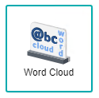
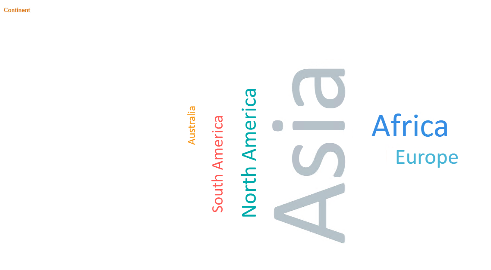
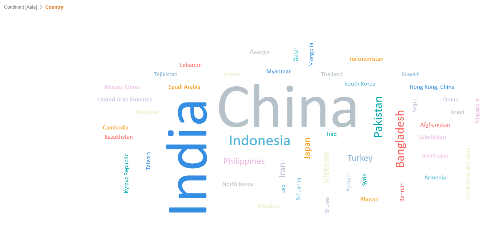
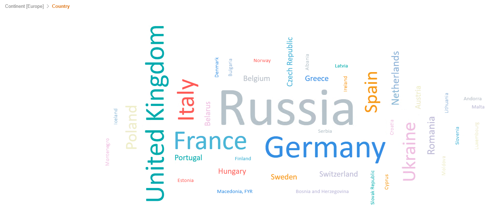
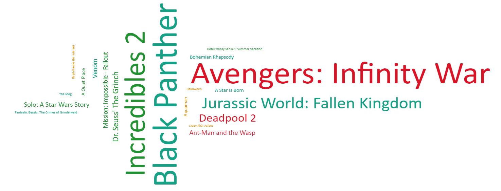

# Word Cloud

Word Cloud is a visualization used to represent keywords of your data which is useful for qualitative analysis. The size of each word or each word group corresponds to the value associated with the word; this can be the frequency of occurrence, amount or some other numerical value. All of the words are randomly arranged horizontally and vertically, in the shape of a cloud. This chart is useful when you need to perform qualitative analysis and when showing the exact value associated with the category items is not that important. Among the uses of word cloud are in analyzing feedback data, analyzing survey data and finding out commonly-used keywords for searching in websites.

## Data Binding

There is only one mandatory binding to generate the chart, which is the **Group** field. However, for the Word Cloud analysis to make sense, you will need to also bind the **Size** field.

For each field, specific data type need to be fulfilled in order for the Word Cloud chart to render correctly, as shown below:

|Bindings |Data Type|
|---|---|
|Group|Text|
|Size|Numeric|

### Group

A field with text data type can be used for **Group** binding. This will be displayed as the Category values.

### Size

A field with numeric data type can be used for **Size** binding. The size of each word will correspond to the value of Size field binding i.e. words with a bigger value will be shown in a larger font size.

## Other Settings

### Actual

Use this field to bind an **Actual** value to *compare against* the **Target** value. The Percentage of Achievement will be shown based on the Threshold setting (the default colours are Red, Yellow and Green).

### Target

Use this field to bind a **Target** value to *compare against* the **Actual** value. The Percentage of Achievement will be shown based on the Threshold setting (the default colours are Red, Yellow and Green).

### Range (% of Target)

When you have the **Actual** and **Target** field bindings, you can specify the threshold for the percentage achievement in this section. The default colours are Red for 0-30%, Yellow for 31-70% and Green for 71-120%.

### Trending

When you have the **Actual** and **Target** field bindings and **Range (% of Target)** specified, you can choose the trending value either Increasing Better or Decreasing Better. For example, the trend Increasing Better is used to track Actual Sales vs Target Sales figures. The trend Decreasing Better is used to track the actual number of crime cases reported against the target number of crime cases.

### Drill Down

If your data contains hierarchy (for example: Region > Country > State), you can use this field to drill down your data from the highest level to the lower levels.

### Sort

You can use this section to specify the order in which your data should be arranged. For example, to sort by Country in ascending order.

### Filter

Add filters to restrict your data so that analysis will be focused on data which are shown in the chart.

## Use Cases

### Population of Citizens within a Country
A dataset of the world's population count is used to see which continent and country has the most amount of people. Thus, using a word cloud would be a very easy method to display this information and users can obtain the analysis at a glance. Download sample data [here](./sample-data/word-cloud/population.csv).

Below are the fields used for the data binding to generate the chart:

|Bindings |Field to Select|
|---|---|
|Group|Continent|
|Size|Population|
|Drill Down|Country|

Displayed in the word cloud are the continents that have the size of each word shown based on their population count. In this example, Asia has the largest population size compared to the other continents, as it has the word displayed in the largest font. Since we have the **Drill Down** binding, clicking on the continent will show the data of the countries under the selected continent.

*Note:* This output shows the **Drill Down** examples for the Asia and Europe continents. A Drill Down Breadcrumb is available on the top-left of the chart to indicate the Drill Down level currently being displayed.

**Output**

### Top Movies of 2018 by the Domestic Box Office
This dataset shows a list of the most popular movies in the year 2018, whereby the movies were ranked according to the Domestic Box Office collections. Download sample data [here](./sample-data/word-cloud/movies.xlsx).

Refer below on the field bindings used for the creation of the word cloud chart. Both of the score fields from **Metacritic** and **Rotten Tomatoes** will be used for the **Actual** and **Target** settings to analyse if the movies achieve similar ratings from two different parties.

|Bindings |Select|
|---|---|
|Group|Title|
|Size|Domestic Gross|
|Actual|Metacritic Score|
|Target|Rotten Tomatoes Score|
|Threshold|Set Trending to *Increasing Better*|
||Set Range starting from 75 - 80%(Red), 80 - 85%(Yellow), 85 - 90%(Green), 90% - 95%(Blue)|

From the chart analysis, it can be concluded that although a movie achieve a high gross value, it may not get a high score rating from both key critics. This can be seen when comparing the size of the movie titles with the colours shown. For example, the movie Avengers: Infinity War achieved a high gross value but it is shown in red, which indicates that there is a gap in score ratings from two of the movie critics.

**Output**

**Analysis**

By analysing the chart deeper, the actual and target trend is set as for the Metacritic score to achieve similar values to Rotten Tomatoes score, where it can be deducted that although a movie grosses a high domestic value, it would not get a high score rating on both parties. Following on, it can also be found that the data is simplified for the ease of view, in order to capture all necessary information at once, knowing which movie is more popular towards critics or regular citizens.